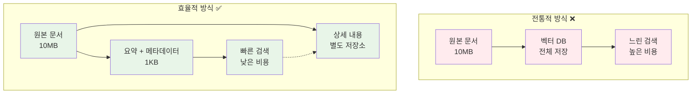
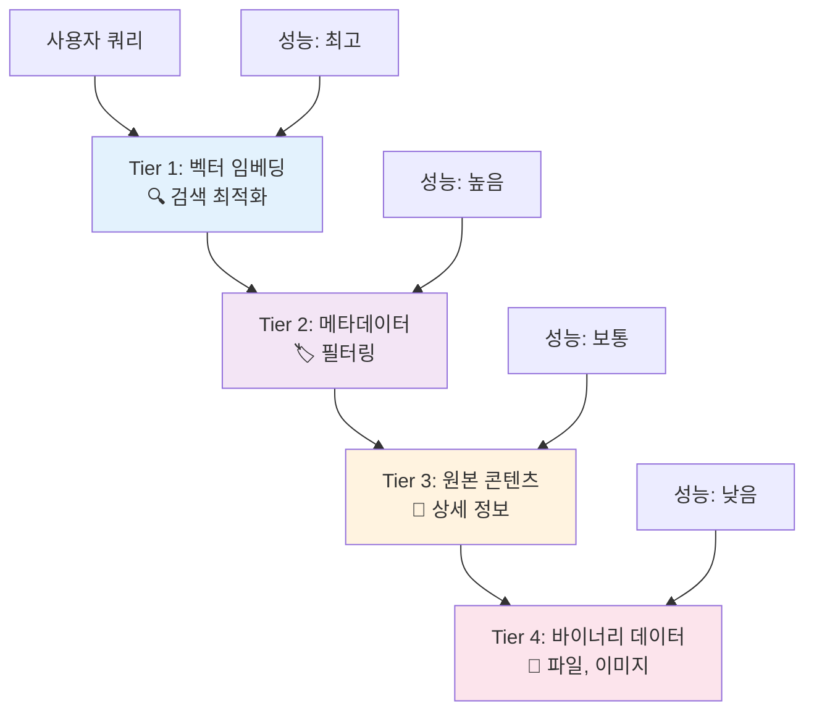
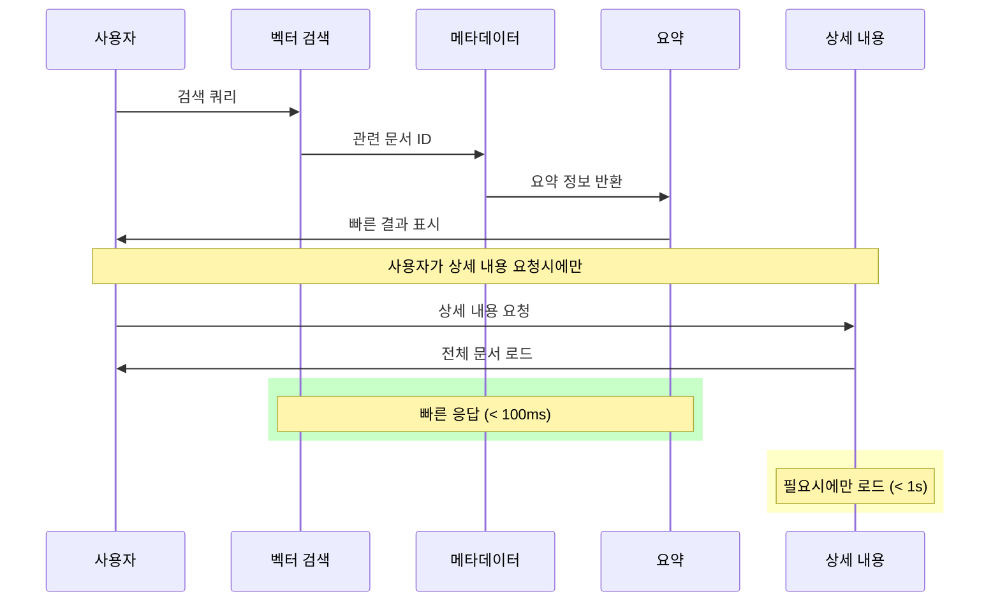

# 핵심 설계 원칙 다이어그램

## 1. 분리의 원칙 (Separation of Concerns)

```mermaid
graph TB
    subgraph "전통적 방식 ❌"
        A1[원본 문서<br/>10MB] --> B1[벡터 DB<br/>전체 저장]
        B1 --> C1[느린 검색<br/>높은 비용]
    end
    
    subgraph "효율적 방식 ✅"
        A2[원본 문서<br/>10MB] --> B2[요약 + 메타데이터<br/>1KB]
        A2 --> B3[상세 내용<br/>별도 저장소]
        B2 --> C2[빠른 검색<br/>낮은 비용]
        C2 -.-> B3
    end
    
    style A1 fill:#ffebee
    style B1 fill:#ffebee
    style C1 fill:#ffebee
    style A2 fill:#e8f5e8
    style B2 fill:#e8f5e8
    style B3 fill:#e8f5e8
    style C2 fill:#e8f5e8
```

## 2. 계층화 저장 (Tiered Storage)

```mermaid
graph TD
    A[사용자 쿼리] --> B[Tier 1: 벡터 임베딩<br/>🔍 검색 최적화]
    B --> C[Tier 2: 메타데이터<br/>🏷️ 필터링]
    C --> D[Tier 3: 원본 콘텐츠<br/>📄 상세 정보]
    D --> E[Tier 4: 바이너리 데이터<br/>📁 파일, 이미지]
    
    F[성능: 최고] --> B
    G[성능: 높음] --> C
    H[성능: 보통] --> D
    I[성능: 낮음] --> E
    
    style B fill:#e3f2fd
    style C fill:#f3e5f5
    style D fill:#fff3e0
    style E fill:#fce4ec
```

## 3. 지연 로딩 (Lazy Loading)

```mermaid
sequenceDiagram
    participant U as 사용자
    participant V as 벡터 검색
    participant M as 메타데이터
    participant S as 요약
    participant D as 상세 내용
    
    U->>V: 검색 쿼리
    V->>M: 관련 문서 ID
    M->>S: 요약 정보 반환
    S->>U: 빠른 결과 표시
    
    Note over U,D: 사용자가 상세 내용 요청시에만
    U->>D: 상세 내용 요청
    D->>U: 전체 문서 로드
    
    rect rgb(200, 255, 200)
        Note over V,S: 빠른 응답 (< 100ms)
    end
    
    rect rgb(255, 255, 200)
        Note over D: 필요시에만 로드 (< 1s)
    end
```
