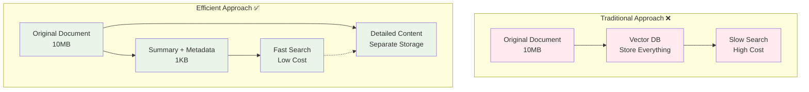
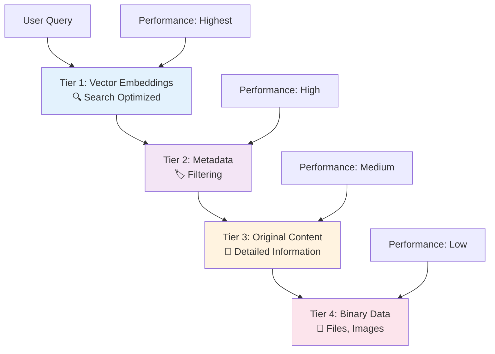
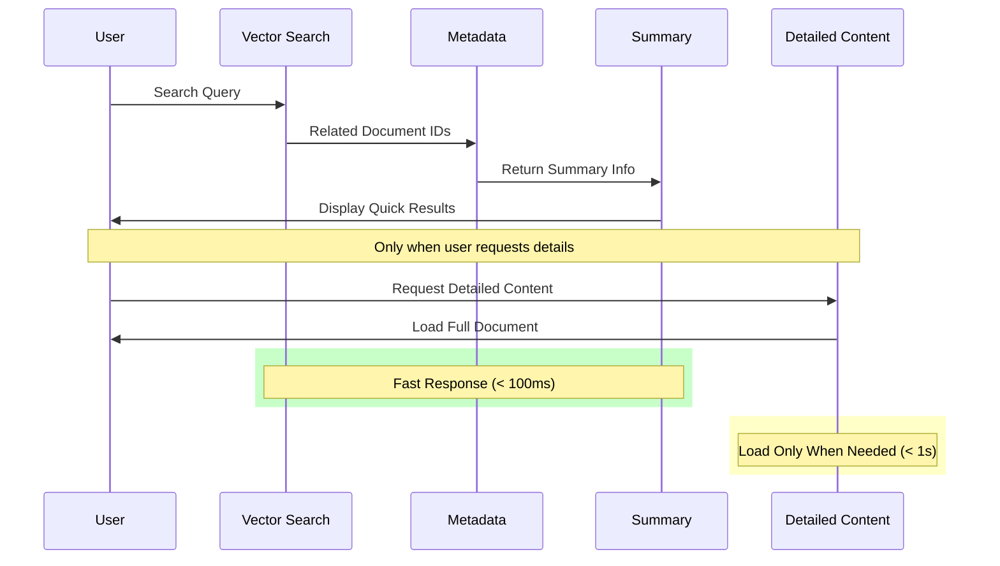

# Core Design Principles Diagrams

## 1. Separation of Concerns

```mermaid
graph TB
    subgraph "Traditional Approach ❌"
        A1[Original Document<br/>10MB] --> B1[Vector DB<br/>Store Everything]
        B1 --> C1[Slow Search<br/>High Cost]
    end

    subgraph "Efficient Approach ✅"
        A2[Original Document<br/>10MB] --> B2[Summary + Metadata<br/>1KB]
        A2 --> B3[Detailed Content<br/>Separate Storage]
        B2 --> C2[Fast Search<br/>Low Cost]
        C2 -.-> B3
    end

    style A1 fill:#ffebee
    style B1 fill:#ffebee
    style C1 fill:#ffebee
    style A2 fill:#e8f5e8
    style B2 fill:#e8f5e8
    style B3 fill:#e8f5e8
    style C2 fill:#e8f5e8
```

## 2. Tiered Storage

```mermaid
graph TD
    A[User Query] --> B[Tier 1: Vector Embeddings<br/>🔍 Search Optimized]
    B --> C[Tier 2: Metadata<br/>🏷️ Filtering]
    C --> D[Tier 3: Original Content<br/>📄 Detailed Information]
    D --> E[Tier 4: Binary Data<br/>📁 Files, Images]

    F[Performance: Highest] --> B
    G[Performance: High] --> C
    H[Performance: Medium] --> D
    I[Performance: Low] --> E

    style B fill:#e3f2fd
    style C fill:#f3e5f5
    style D fill:#fff3e0
    style E fill:#fce4ec
```

## 3. Lazy Loading

```mermaid
sequenceDiagram
    participant U as User
    participant V as Vector Search
    participant M as Metadata
    participant S as Summary
    participant D as Detailed Content

    U->>V: Search Query
    V->>M: Related Document IDs
    M->>S: Return Summary Info
    S->>U: Display Quick Results

    Note over U,D: Only when user requests details
    U->>D: Request Detailed Content
    D->>U: Load Full Document

    rect rgb(200, 255, 200)
        Note over V,S: Fast Response (< 100ms)
    end

    rect rgb(255, 255, 200)
        Note over D: Load Only When Needed (< 1s)
    end
```
