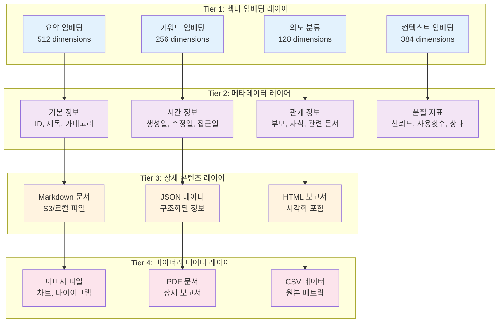
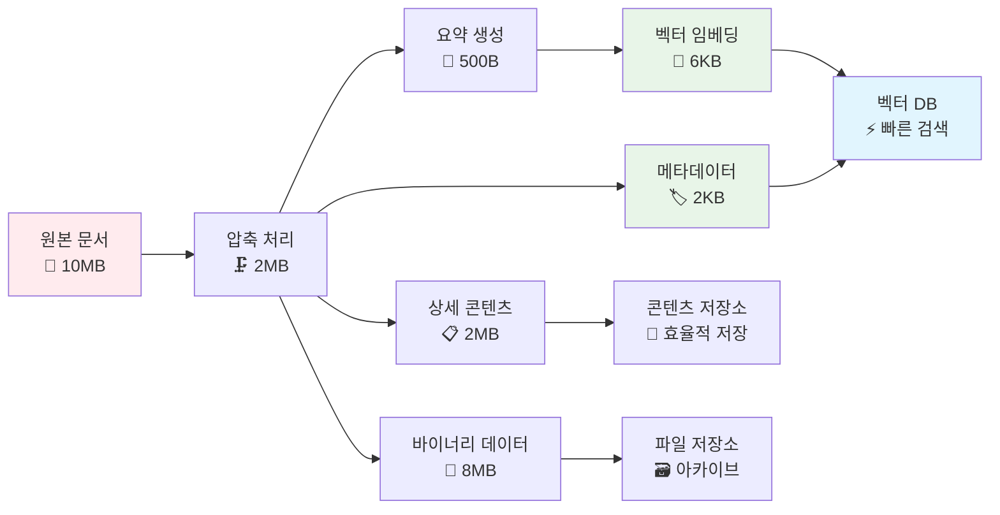
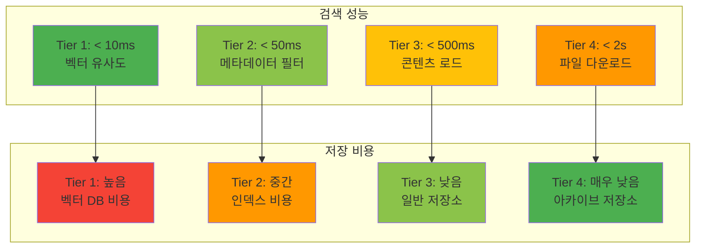

# 계층화된 저장 아키텍처 다이어그램

## 전체 아키텍처 개요

```mermaid
graph TB
    subgraph "Tier 1: 벡터 임베딩 레이어"
        V1[요약 임베딩<br/>512 dimensions]
        V2[키워드 임베딩<br/>256 dimensions]
        V3[의도 분류<br/>128 dimensions]
        V4[컨텍스트 임베딩<br/>384 dimensions]
    end
    
    subgraph "Tier 2: 메타데이터 레이어"
        M1[기본 정보<br/>ID, 제목, 카테고리]
        M2[시간 정보<br/>생성일, 수정일, 접근일]
        M3[관계 정보<br/>부모, 자식, 관련 문서]
        M4[품질 지표<br/>신뢰도, 사용횟수, 상태]
    end
    
    subgraph "Tier 3: 상세 콘텐츠 레이어"
        C1[Markdown 문서<br/>S3/로컬 파일]
        C2[JSON 데이터<br/>구조화된 정보]
        C3[HTML 보고서<br/>시각화 포함]
    end
    
    subgraph "Tier 4: 바이너리 데이터 레이어"
        B1[이미지 파일<br/>차트, 다이어그램]
        B2[PDF 문서<br/>상세 보고서]
        B3[CSV 데이터<br/>원본 메트릭]
    end
    
    V1 --> M1
    V2 --> M2
    V3 --> M3
    V4 --> M4
    
    M1 --> C1
    M2 --> C2
    M3 --> C3
    
    C1 --> B1
    C2 --> B2
    C3 --> B3
    
    style V1 fill:#e3f2fd
    style V2 fill:#e3f2fd
    style V3 fill:#e3f2fd
    style V4 fill:#e3f2fd
    style M1 fill:#f3e5f5
    style M2 fill:#f3e5f5
    style M3 fill:#f3e5f5
    style M4 fill:#f3e5f5
    style C1 fill:#fff3e0
    style C2 fill:#fff3e0
    style C3 fill:#fff3e0
    style B1 fill:#fce4ec
    style B2 fill:#fce4ec
    style B3 fill:#fce4ec
```

## 데이터 흐름 및 크기 비교

```mermaid
graph LR
    A[원본 문서<br/>📄 10MB] --> B[압축 처리<br/>🗜️ 2MB]
    B --> C[요약 생성<br/>📝 500B]
    C --> D[벡터 임베딩<br/>🔢 6KB]
    
    B --> E[메타데이터<br/>🏷️ 2KB]
    B --> F[상세 콘텐츠<br/>📋 2MB]
    B --> G[바이너리 데이터<br/>📁 8MB]
    
    D --> H[벡터 DB<br/>⚡ 빠른 검색]
    E --> H
    F --> I[콘텐츠 저장소<br/>💾 효율적 저장]
    G --> J[파일 저장소<br/>🗃️ 아카이브]
    
    style A fill:#ffebee
    style D fill:#e8f5e8
    style E fill:#e8f5e8
    style H fill:#e1f5fe
```

## 성능 특성 비교

```mermaid
graph TB
    subgraph "검색 성능"
        P1[Tier 1: < 10ms<br/>벡터 유사도]
        P2[Tier 2: < 50ms<br/>메타데이터 필터]
        P3[Tier 3: < 500ms<br/>콘텐츠 로드]
        P4[Tier 4: < 2s<br/>파일 다운로드]
    end
    
    subgraph "저장 비용"
        C1[Tier 1: 높음<br/>벡터 DB 비용]
        C2[Tier 2: 중간<br/>인덱스 비용]
        C3[Tier 3: 낮음<br/>일반 저장소]
        C4[Tier 4: 매우 낮음<br/>아카이브 저장소]
    end
    
    P1 --> C1
    P2 --> C2
    P3 --> C3
    P4 --> C4
    
    style P1 fill:#4caf50
    style P2 fill:#8bc34a
    style P3 fill:#ffc107
    style P4 fill:#ff9800
    style C1 fill:#f44336
    style C2 fill:#ff9800
    style C3 fill:#8bc34a
    style C4 fill:#4caf50
```
