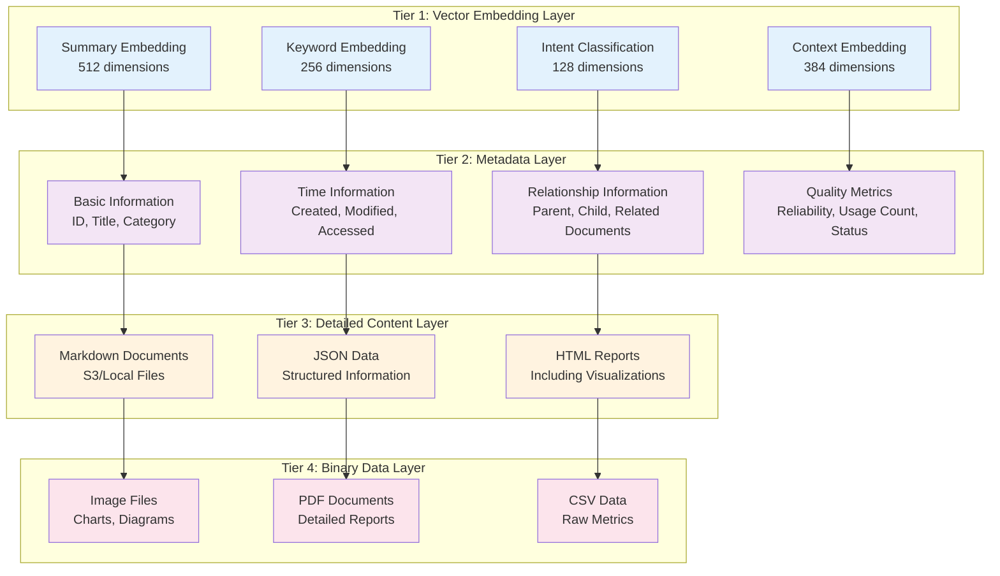
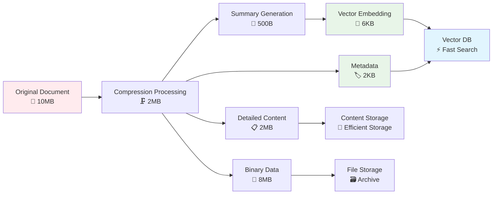
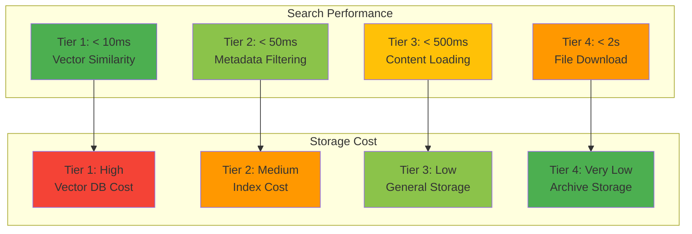

# Tiered Storage Architecture Diagrams

## Overall Architecture Overview

```mermaid
graph TB
    subgraph "Tier 1: Vector Embedding Layer"
        V1[Summary Embedding<br/>512 dimensions]
        V2[Keyword Embedding<br/>256 dimensions]
        V3[Intent Classification<br/>128 dimensions]
        V4[Context Embedding<br/>384 dimensions]
    end

    subgraph "Tier 2: Metadata Layer"
        M1[Basic Information<br/>ID, Title, Category]
        M2[Time Information<br/>Created, Modified, Accessed]
        M3[Relationship Information<br/>Parent, Child, Related Documents]
        M4[Quality Metrics<br/>Reliability, Usage Count, Status]
    end

    subgraph "Tier 3: Detailed Content Layer"
        C1[Markdown Documents<br/>S3/Local Files]
        C2[JSON Data<br/>Structured Information]
        C3[HTML Reports<br/>Including Visualizations]
    end

    subgraph "Tier 4: Binary Data Layer"
        B1[Image Files<br/>Charts, Diagrams]
        B2[PDF Documents<br/>Detailed Reports]
        B3[CSV Data<br/>Raw Metrics]
    end

    V1 --> M1
    V2 --> M2
    V3 --> M3
    V4 --> M4

    M1 --> C1
    M2 --> C2
    M3 --> C3

    C1 --> B1
    C2 --> B2
    C3 --> B3

    style V1 fill:#e3f2fd
    style V2 fill:#e3f2fd
    style V3 fill:#e3f2fd
    style V4 fill:#e3f2fd
    style M1 fill:#f3e5f5
    style M2 fill:#f3e5f5
    style M3 fill:#f3e5f5
    style M4 fill:#f3e5f5
    style C1 fill:#fff3e0
    style C2 fill:#fff3e0
    style C3 fill:#fff3e0
    style B1 fill:#fce4ec
    style B2 fill:#fce4ec
    style B3 fill:#fce4ec
```

## Data Flow and Size Comparison

```mermaid
graph LR
    A[Original Document<br/>📄 10MB] --> B[Compression Processing<br/>🗜️ 2MB]
    B --> C[Summary Generation<br/>📝 500B]
    C --> D[Vector Embedding<br/>🔢 6KB]

    B --> E[Metadata<br/>🏷️ 2KB]
    B --> F[Detailed Content<br/>📋 2MB]
    B --> G[Binary Data<br/>📁 8MB]

    D --> H[Vector DB<br/>⚡ Fast Search]
    E --> H
    F --> I[Content Storage<br/>💾 Efficient Storage]
    G --> J[File Storage<br/>🗃️ Archive]

    style A fill:#ffebee
    style D fill:#e8f5e8
    style E fill:#e8f5e8
    style H fill:#e1f5fe
```

## Performance Characteristics Comparison

```mermaid
graph TB
    subgraph "Search Performance"
        P1[Tier 1: < 10ms<br/>Vector Similarity]
        P2[Tier 2: < 50ms<br/>Metadata Filtering]
        P3[Tier 3: < 500ms<br/>Content Loading]
        P4[Tier 4: < 2s<br/>File Download]
    end

    subgraph "Storage Cost"
        C1[Tier 1: High<br/>Vector DB Cost]
        C2[Tier 2: Medium<br/>Index Cost]
        C3[Tier 3: Low<br/>General Storage]
        C4[Tier 4: Very Low<br/>Archive Storage]
    end

    P1 --> C1
    P2 --> C2
    P3 --> C3
    P4 --> C4

    style P1 fill:#4caf50
    style P2 fill:#8bc34a
    style P3 fill:#ffc107
    style P4 fill:#ff9800
    style C1 fill:#f44336
    style C2 fill:#ff9800
    style C3 fill:#8bc34a
    style C4 fill:#4caf50
```
