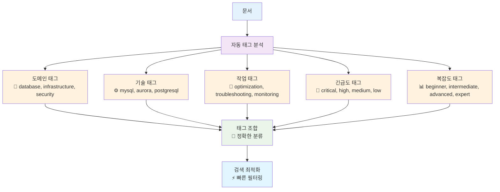
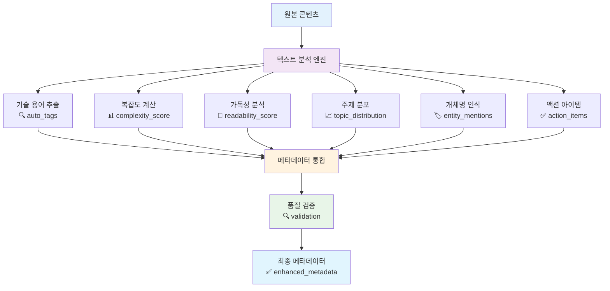

# 메타데이터 최적화 다이어그램

## 1. 계층적 태그 시스템



## 2. 동적 메타데이터 생성 프로세스



## 3. 버전 관리 및 변경 추적

```mermaid
gitgraph
    commit id: "v1.0.0 초기 생성"
    commit id: "v1.1.0 태그 추가"
    branch feature
    checkout feature
    commit id: "v1.1.1 오타 수정"
    commit id: "v1.2.0 성능 지표 추가"
    checkout main
    merge feature
    commit id: "v1.2.1 병합 완료"
    commit id: "v1.3.0 새 섹션 추가"
```

## 4. 메타데이터 구조 시각화

```mermaid
graph TB
    subgraph "기본 정보"
        A1[ID: doc_20250911_001]
        A2[제목: 성능 최적화 가이드]
        A3[카테고리: performance-optimization]
        A4[작성자: DB Assistant]
    end
    
    subgraph "시간 정보"
        B1[생성일: 2025-09-11T08:30:00Z]
        B2[수정일: 2025-09-11T08:35:00Z]
        B3[접근일: 2025-09-11T08:36:00Z]
    end
    
    subgraph "관계 정보"
        C1[부모: doc_20250910_005]
        C2[자식: doc_20250911_002, doc_20250911_003]
        C3[관련: doc_20250909_001, doc_20250908_004]
    end
    
    subgraph "품질 지표"
        D1[신뢰도: 0.95]
        D2[사용횟수: 42]
        D3[상태: active]
        D4[검증: verified]
    end
    
    subgraph "자동 생성 태그"
        E1[기술: mysql, aurora, index]
        E2[작업: optimization, tuning]
        E3[복잡도: intermediate]
        E4[긴급도: medium]
    end
    
    A1 --> F[통합 메타데이터]
    A2 --> F
    A3 --> F
    A4 --> F
    B1 --> F
    B2 --> F
    B3 --> F
    C1 --> F
    C2 --> F
    C3 --> F
    D1 --> F
    D2 --> F
    D3 --> F
    D4 --> F
    E1 --> F
    E2 --> F
    E3 --> F
    E4 --> F
    
    F --> G[검색 최적화<br/>⚡ 빠른 필터링]
    
    style F fill:#e1f5fe
    style G fill:#4caf50
```



## 5. 메타데이터 활용 시나리오

```mermaid
graph LR
    A[사용자 쿼리<br/>"MySQL 성능 최적화"] --> B[메타데이터 필터링]
    
    B --> C[카테고리 필터<br/>performance-optimization]
    B --> D[기술 태그 필터<br/>mysql]
    B --> E[복잡도 필터<br/>intermediate]
    B --> F[신뢰도 필터<br/>> 0.8]
    
    C --> G[결과 조합<br/>🎯 정확한 매칭]
    D --> G
    E --> G
    F --> G
    
    G --> H[랭킹 조정<br/>📊 사용횟수 + 최신성]
    H --> I[최종 결과<br/>✅ 관련성 높은 문서]
    
    style A fill:#e3f2fd
    style G fill:#fff3e0
    style H fill:#e8f5e8
    style I fill:#4caf50
```
