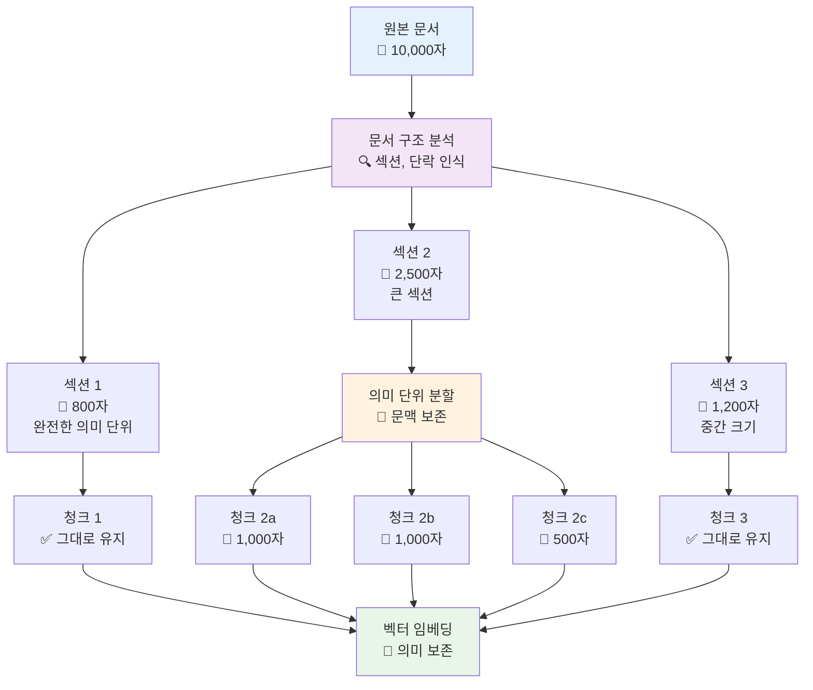
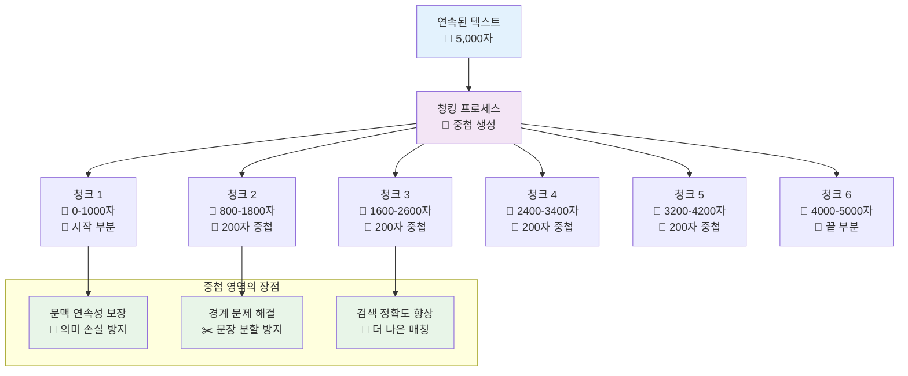
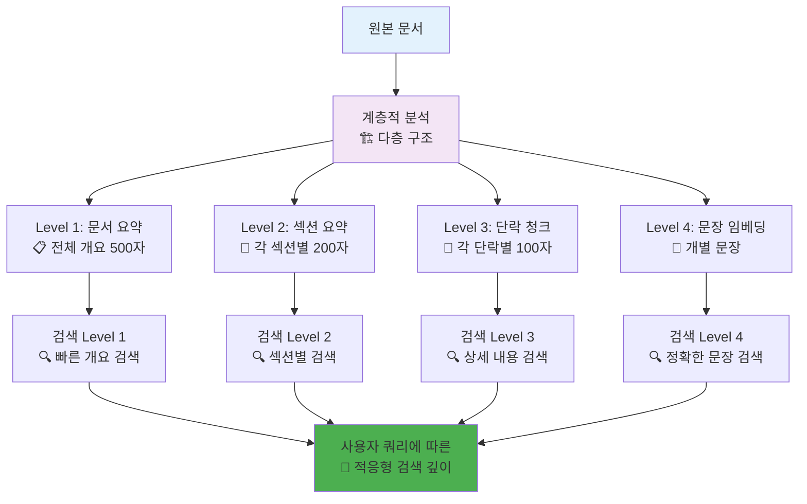
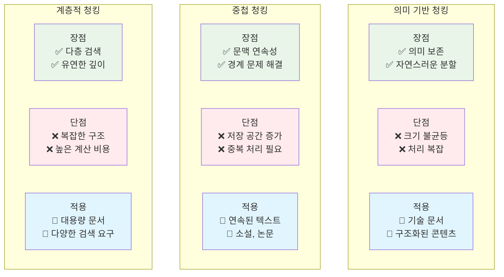
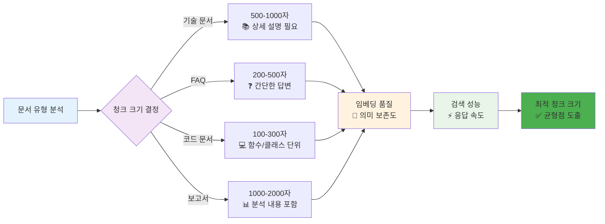
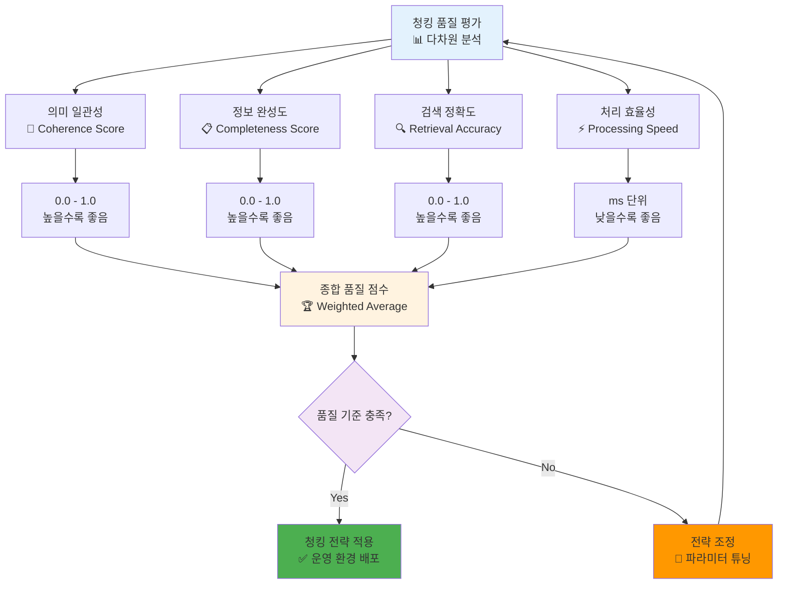

# 청킹 전략 다이어그램

## 1. 의미 기반 청킹 (Semantic Chunking)

```mermaid
graph TD
    A[원본 문서<br/>📄 10,000자] --> B[문서 구조 분석<br/>🔍 섹션, 단락 인식]
    
    B --> C[섹션 1<br/>📝 800자<br/>완전한 의미 단위]
    B --> D[섹션 2<br/>📝 2,500자<br/>큰 섹션]
    B --> E[섹션 3<br/>📝 1,200자<br/>중간 크기]
    
    C --> F[청크 1<br/>✅ 그대로 유지]
    
    D --> G[의미 단위 분할<br/>🔄 문맥 보존]
    G --> H[청크 2a<br/>📝 1,000자]
    G --> I[청크 2b<br/>📝 1,000자]
    G --> J[청크 2c<br/>📝 500자]
    
    E --> K[청크 3<br/>✅ 그대로 유지]
    
    F --> L[벡터 임베딩<br/>🔢 의미 보존]
    H --> L
    I --> L
    J --> L
    K --> L
    
    style A fill:#e3f2fd
    style B fill:#f3e5f5
    style G fill:#fff3e0
    style L fill:#e8f5e8
```

## 2. 중첩 청킹 (Overlapping Chunks)

```mermaid
graph TB
    A[연속된 텍스트<br/>📄 5,000자] --> B[청킹 프로세스<br/>🔄 중첩 생성]
    
    B --> C[청크 1<br/>📝 0-1000자<br/>🎯 시작 부분]
    B --> D[청크 2<br/>📝 800-1800자<br/>🔄 200자 중첩]
    B --> E[청크 3<br/>📝 1600-2600자<br/>🔄 200자 중첩]
    B --> F[청크 4<br/>📝 2400-3400자<br/>🔄 200자 중첩]
    B --> G[청크 5<br/>📝 3200-4200자<br/>🔄 200자 중첩]
    B --> H[청크 6<br/>📝 4000-5000자<br/>🎯 끝 부분]
    
    subgraph "중첩 영역의 장점"
        I[문맥 연속성 보장<br/>🔗 의미 손실 방지]
        J[경계 문제 해결<br/>✂️ 문장 분할 방지]
        K[검색 정확도 향상<br/>🎯 더 나은 매칭]
    end
    
    C --> I
    D --> J
    E --> K
    
    style A fill:#e3f2fd
    style B fill:#f3e5f5
    style I fill:#e8f5e8
    style J fill:#e8f5e8
    style K fill:#e8f5e8
```

## 3. 계층적 청킹 (Hierarchical Chunking)

```mermaid
graph TD
    A[원본 문서] --> B[계층적 분석<br/>🏗️ 다층 구조]
    
    B --> C[Level 1: 문서 요약<br/>📋 전체 개요 500자]
    B --> D[Level 2: 섹션 요약<br/>📝 각 섹션별 200자]
    B --> E[Level 3: 단락 청크<br/>📄 각 단락별 100자]
    B --> F[Level 4: 문장 임베딩<br/>📝 개별 문장]
    
    C --> G[검색 Level 1<br/>🔍 빠른 개요 검색]
    D --> H[검색 Level 2<br/>🔍 섹션별 검색]
    E --> I[검색 Level 3<br/>🔍 상세 내용 검색]
    F --> J[검색 Level 4<br/>🔍 정확한 문장 검색]
    
    G --> K[사용자 쿼리에 따른<br/>🎯 적응형 검색 깊이]
    H --> K
    I --> K
    J --> K
    
    style A fill:#e3f2fd
    style B fill:#f3e5f5
    style K fill:#4caf50
```

## 4. 청킹 전략 비교

```mermaid
graph TB
    subgraph "의미 기반 청킹"
        A1[장점<br/>✅ 의미 보존<br/>✅ 자연스러운 분할]
        A2[단점<br/>❌ 크기 불균등<br/>❌ 처리 복잡]
        A3[적용<br/>🎯 기술 문서<br/>🎯 구조화된 콘텐츠]
    end
    
    subgraph "중첩 청킹"
        B1[장점<br/>✅ 문맥 연속성<br/>✅ 경계 문제 해결]
        B2[단점<br/>❌ 저장 공간 증가<br/>❌ 중복 처리 필요]
        B3[적용<br/>🎯 연속된 텍스트<br/>🎯 소설, 논문]
    end
    
    subgraph "계층적 청킹"
        C1[장점<br/>✅ 다층 검색<br/>✅ 유연한 깊이]
        C2[단점<br/>❌ 복잡한 구조<br/>❌ 높은 계산 비용]
        C3[적용<br/>🎯 대용량 문서<br/>🎯 다양한 검색 요구]
    end
    
    style A1 fill:#e8f5e8
    style B1 fill:#e8f5e8
    style C1 fill:#e8f5e8
    style A2 fill:#ffebee
    style B2 fill:#ffebee
    style C2 fill:#ffebee
    style A3 fill:#e1f5fe
    style B3 fill:#e1f5fe
    style C3 fill:#e1f5fe
```

## 5. 청킹 크기 최적화

```mermaid
graph LR
    A[문서 유형 분석] --> B{청크 크기 결정}
    
    B -->|기술 문서| C[500-1000자<br/>📚 상세 설명 필요]
    B -->|FAQ| D[200-500자<br/>❓ 간단한 답변]
    B -->|코드 문서| E[100-300자<br/>💻 함수/클래스 단위]
    B -->|보고서| F[1000-2000자<br/>📊 분석 내용 포함]
    
    C --> G[임베딩 품질<br/>🎯 의미 보존도]
    D --> G
    E --> G
    F --> G
    
    G --> H[검색 성능<br/>⚡ 응답 속도]
    H --> I[최적 청크 크기<br/>✅ 균형점 도출]
    
    style A fill:#e3f2fd
    style B fill:#f3e5f5
    style G fill:#fff3e0
    style H fill:#e8f5e8
    style I fill:#4caf50
```

## 6. 청킹 품질 평가 지표

```mermaid
graph TD
    A[청킹 품질 평가<br/>📊 다차원 분석] --> B[의미 일관성<br/>🎯 Coherence Score]
    A --> C[정보 완성도<br/>📋 Completeness Score]
    A --> D[검색 정확도<br/>🔍 Retrieval Accuracy]
    A --> E[처리 효율성<br/>⚡ Processing Speed]
    
    B --> F[0.0 - 1.0<br/>높을수록 좋음]
    C --> G[0.0 - 1.0<br/>높을수록 좋음]
    D --> H[0.0 - 1.0<br/>높을수록 좋음]
    E --> I[ms 단위<br/>낮을수록 좋음]
    
    F --> J[종합 품질 점수<br/>🏆 Weighted Average]
    G --> J
    H --> J
    I --> J
    
    J --> K{품질 기준 충족?}
    K -->|Yes| L[청킹 전략 적용<br/>✅ 운영 환경 배포]
    K -->|No| M[전략 조정<br/>🔄 파라미터 튜닝]
    
    M --> A
    
    style A fill:#e3f2fd
    style J fill:#fff3e0
    style K fill:#f3e5f5
    style L fill:#4caf50
    style M fill:#ff9800
```
