# Chunking Strategy Diagrams

## 1. Semantic Chunking

```mermaid
graph TD
    A[Original Document<br/>📄 10,000 characters] --> B[Document Structure Analysis<br/>🔍 Section, Paragraph Recognition]

    B --> C[Section 1<br/>📝 800 characters<br/>Complete Semantic Unit]
    B --> D[Section 2<br/>📝 2,500 characters<br/>Large Section]
    B --> E[Section 3<br/>📝 1,200 characters<br/>Medium Size]

    C --> F[Chunk 1<br/>✅ Keep As Is]

    D --> G[Semantic Unit Division<br/>🔄 Context Preservation]
    G --> H[Chunk 2a<br/>📝 1,000 characters]
    G --> I[Chunk 2b<br/>📝 1,000 characters]
    G --> J[Chunk 2c<br/>📝 500 characters]

    E --> K[Chunk 3<br/>✅ Keep As Is]

    F --> L[Vector Embedding<br/>🔢 Meaning Preservation]
    H --> L
    I --> L
    J --> L
    K --> L

    style A fill:#e3f2fd
    style B fill:#f3e5f5
    style G fill:#fff3e0
    style L fill:#e8f5e8
```

## 2. Overlapping Chunks

```mermaid
graph TB
    A[Continuous Text<br/>📄 5,000 characters] --> B[Chunking Process<br/>🔄 Create Overlaps]

    B --> C[Chunk 1<br/>📝 0-1000 chars<br/>🎯 Beginning Part]
    B --> D[Chunk 2<br/>📝 800-1800 chars<br/>🔄 200 char overlap]
    B --> E[Chunk 3<br/>📝 1600-2600 chars<br/>🔄 200 char overlap]
    B --> F[Chunk 4<br/>📝 2400-3400 chars<br/>🔄 200 char overlap]
    B --> G[Chunk 5<br/>📝 3200-4200 chars<br/>🔄 200 char overlap]
    B --> H[Chunk 6<br/>📝 4000-5000 chars<br/>🎯 End Part]

    subgraph "Advantages of Overlapping Regions"
        I[Ensure Context Continuity<br/>🔗 Prevent Meaning Loss]
        J[Solve Boundary Issues<br/>✂️ Prevent Sentence Splitting]
        K[Improve Search Accuracy<br/>🎯 Better Matching]
    end

    C --> I
    D --> J
    E --> K

    style A fill:#e3f2fd
    style B fill:#f3e5f5
    style I fill:#e8f5e8
    style J fill:#e8f5e8
    style K fill:#e8f5e8
```

## 3. Hierarchical Chunking

```mermaid
graph TD
    A[Original Document] --> B[Hierarchical Analysis<br/>🏗️ Multi-layer Structure]

    B --> C[Level 1: Document Summary<br/>📋 Overall Overview 500 chars]
    B --> D[Level 2: Section Summaries<br/>📝 200 chars per section]
    B --> E[Level 3: Paragraph Chunks<br/>📄 100 chars per paragraph]
    B --> F[Level 4: Sentence Embeddings<br/>📝 Individual Sentences]

    C --> G[Search Level 1<br/>🔍 Fast Overview Search]
    D --> H[Search Level 2<br/>🔍 Section-based Search]
    E --> I[Search Level 3<br/>🔍 Detailed Content Search]
    F --> J[Search Level 4<br/>🔍 Precise Sentence Search]

    G --> K[Adaptive Search Depth<br/>🎯 Based on User Query]
    H --> K
    I --> K
    J --> K

    style A fill:#e3f2fd
    style B fill:#f3e5f5
    style K fill:#4caf50
```

## 4. Chunking Strategy Comparison

```mermaid
graph TB
    subgraph "Semantic Chunking"
        A1[Advantages<br/>✅ Meaning Preservation<br/>✅ Natural Splitting]
        A2[Disadvantages<br/>❌ Uneven Sizes<br/>❌ Complex Processing]
        A3[Applications<br/>🎯 Technical Documents<br/>🎯 Structured Content]
    end

    subgraph "Overlapping Chunking"
        B1[Advantages<br/>✅ Context Continuity<br/>✅ Boundary Problem Solving]
        B2[Disadvantages<br/>❌ Increased Storage<br/>❌ Duplicate Processing Needed]
        B3[Applications<br/>🎯 Continuous Text<br/>🎯 Novels, Papers]
    end

    subgraph "Hierarchical Chunking"
        C1[Advantages<br/>✅ Multi-level Search<br/>✅ Flexible Depth]
        C2[Disadvantages<br/>❌ Complex Structure<br/>❌ High Computation Cost]
        C3[Applications<br/>🎯 Large Documents<br/>🎯 Diverse Search Needs]
    end

    style A1 fill:#e8f5e8
    style B1 fill:#e8f5e8
    style C1 fill:#e8f5e8
    style A2 fill:#ffebee
    style B2 fill:#ffebee
    style C2 fill:#ffebee
    style A3 fill:#e1f5fe
    style B3 fill:#e1f5fe
    style C3 fill:#e1f5fe
```

## 5. Chunk Size Optimization

## 6. Chunking Quality Evaluation Metrics

