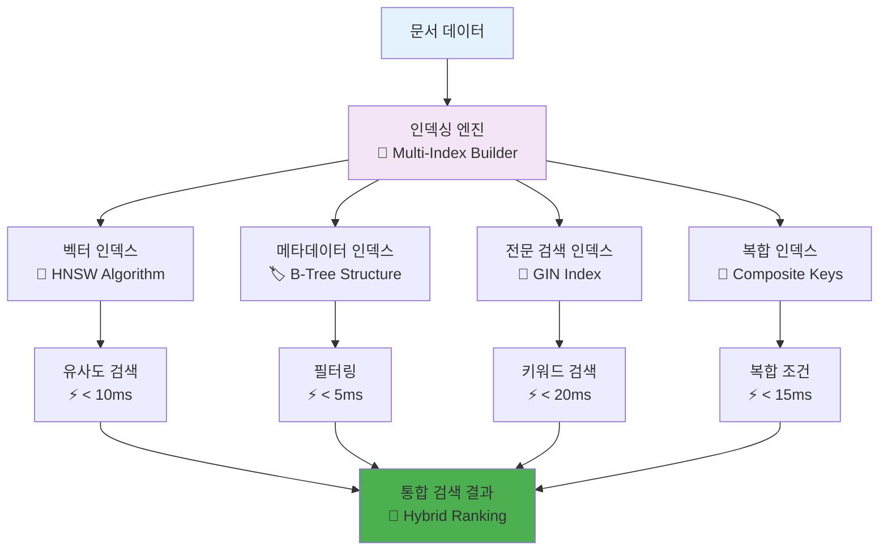
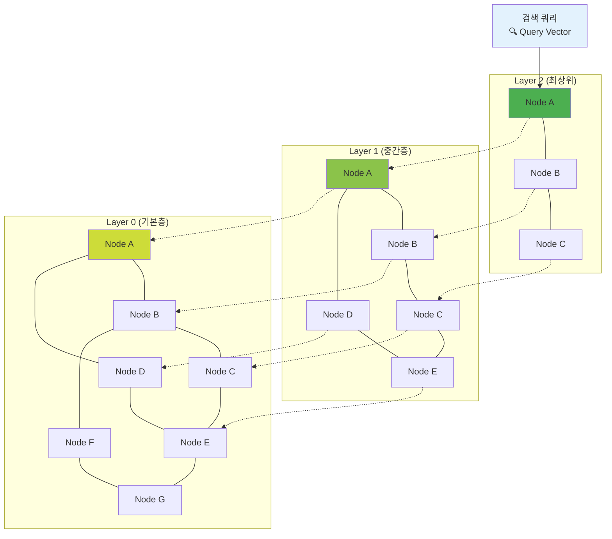
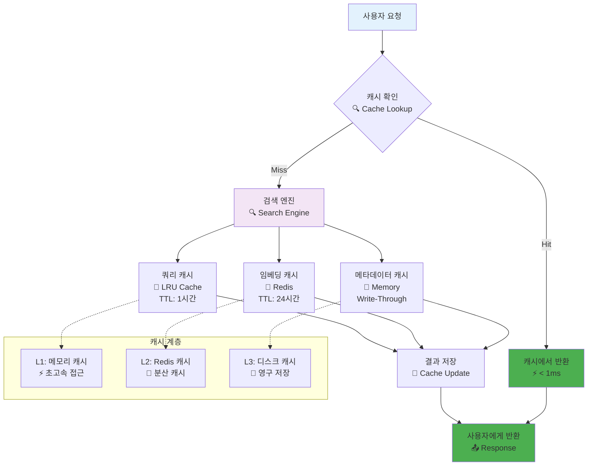
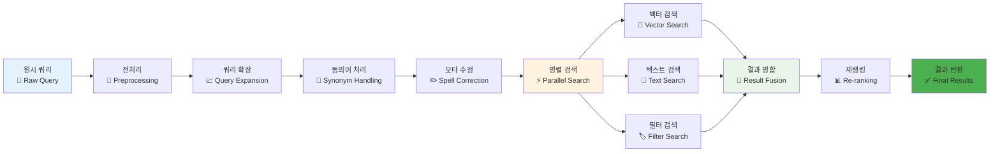
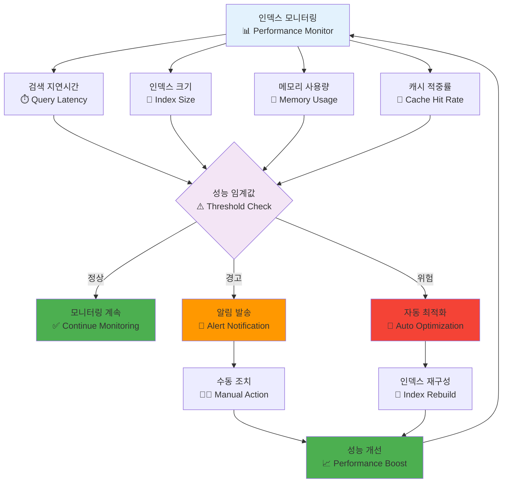
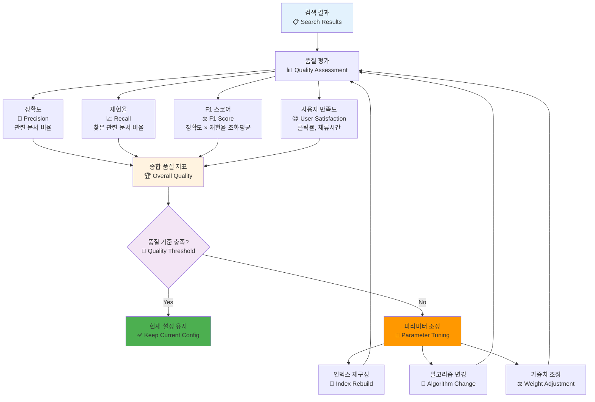

# 인덱싱 및 검색 최적화 다이어그램

## 1. 다중 인덱스 전략



## 2. HNSW 벡터 인덱스 구조



## 3. 적응형 검색 (Adaptive Search) 프로세스

```mermaid
flowchart TD
    A[사용자 쿼리<br/>🔍 "MySQL 성능 최적화"] --> B[쿼리 분석<br/>🧠 Intent Classification]
    
    B --> C[벡터 검색<br/>🔢 Semantic Similarity]
    B --> D[키워드 검색<br/>📝 Exact Match]
    B --> E[메타데이터 필터<br/>🏷️ Category Filter]
    
    C --> F[벡터 스코어<br/>📊 0.85]
    D --> G[키워드 스코어<br/>📊 0.92]
    E --> H[메타데이터 스코어<br/>📊 0.78]
    
    F --> I[하이브리드 스코어링<br/>🎯 Weighted Combination]
    G --> I
    H --> I
    
    I --> J[신선도 보정<br/>📅 Freshness Boost]
    I --> K[사용빈도 보정<br/>📈 Usage Boost]
    I --> L[품질 보정<br/>⭐ Quality Boost]
    
    J --> M[최종 랭킹<br/>🏆 Final Score]
    K --> M
    L --> M
    
    M --> N[결과 반환<br/>✅ Top-K Results]
    
    style A fill:#e3f2fd
    style B fill:#f3e5f5
    style I fill:#fff3e0
    style M fill:#e8f5e8
    style N fill:#4caf50
```

## 4. 캐싱 전략 아키텍처



## 5. 검색 성능 최적화 파이프라인



## 6. 인덱스 성능 모니터링



## 7. 검색 결과 품질 평가


