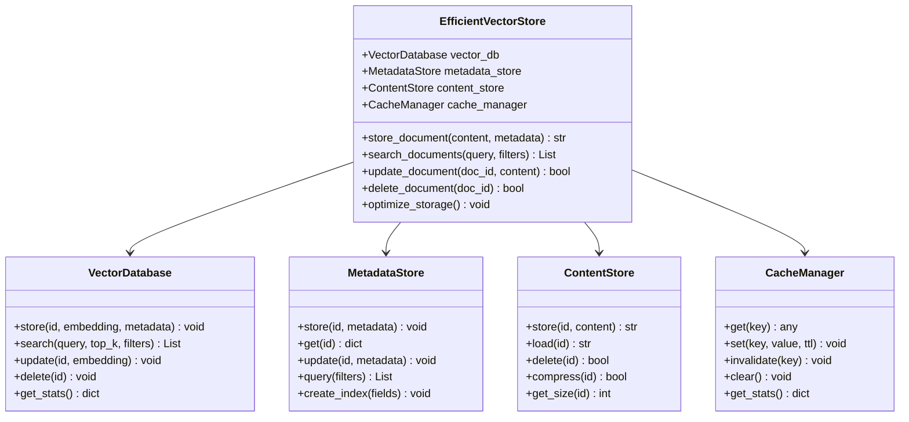
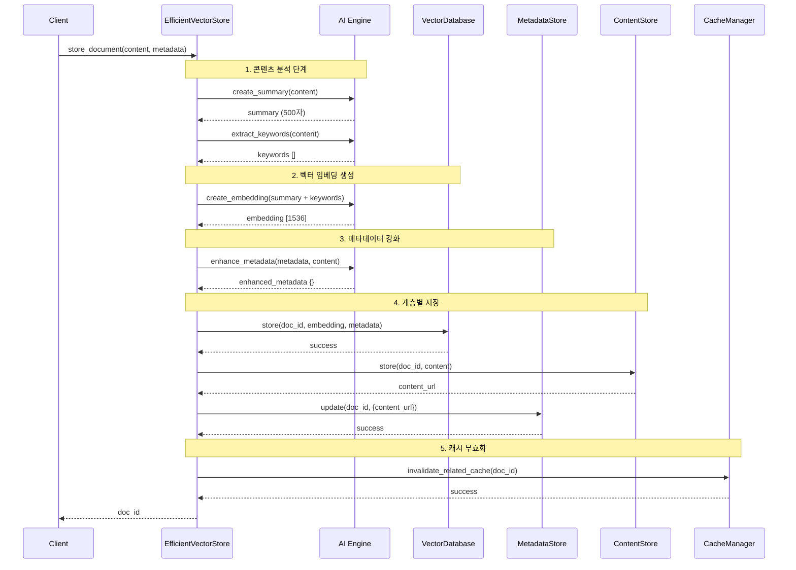
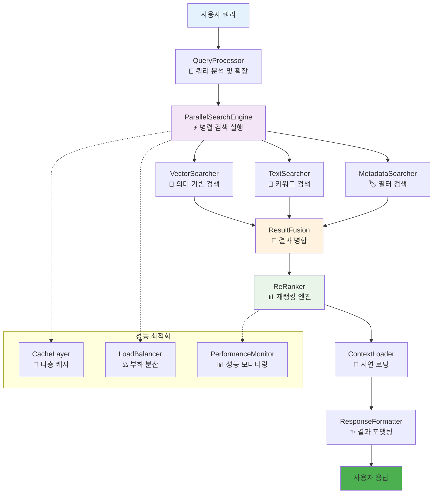
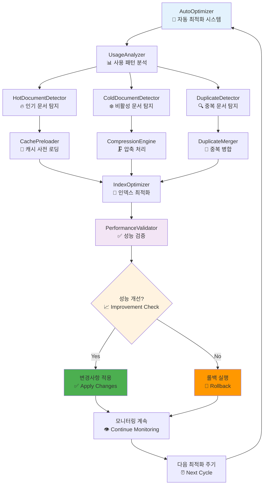
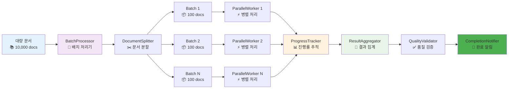
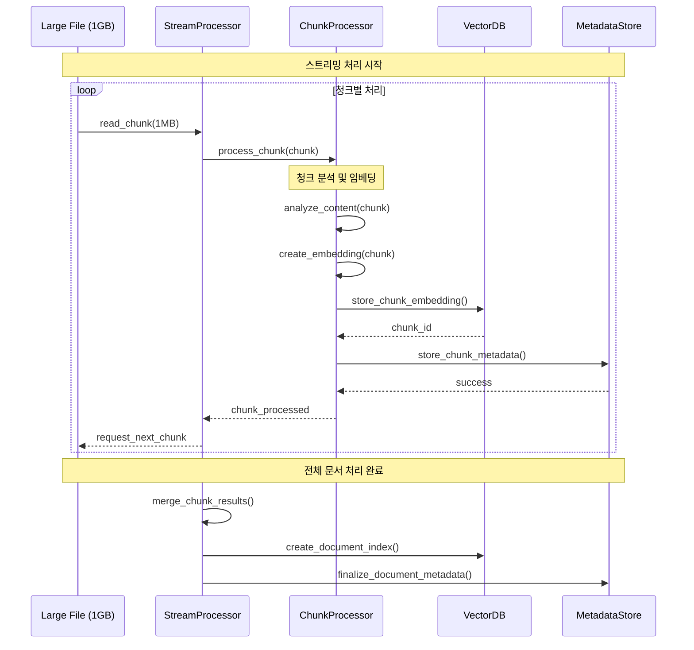
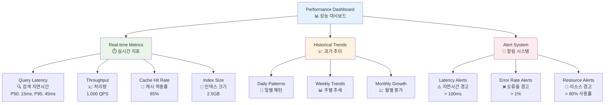
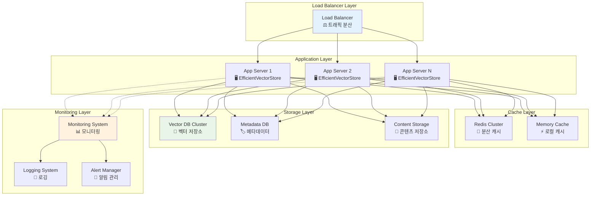

# 실제 구현 예시 다이어그램

## 1. EfficientVectorStore 클래스 아키텍처

## 2. 문서 저장 프로세스 플로우

## 3. 지능형 검색 시스템 아키텍처

## 4. 자동 최적화 시스템 워크플로우

## 5. 배치 처리 시스템

## 6. 메모리 효율적 스트리밍 처리

## 7. 성능 모니터링 대시보드

## 8. 시스템 확장성 아키텍처

