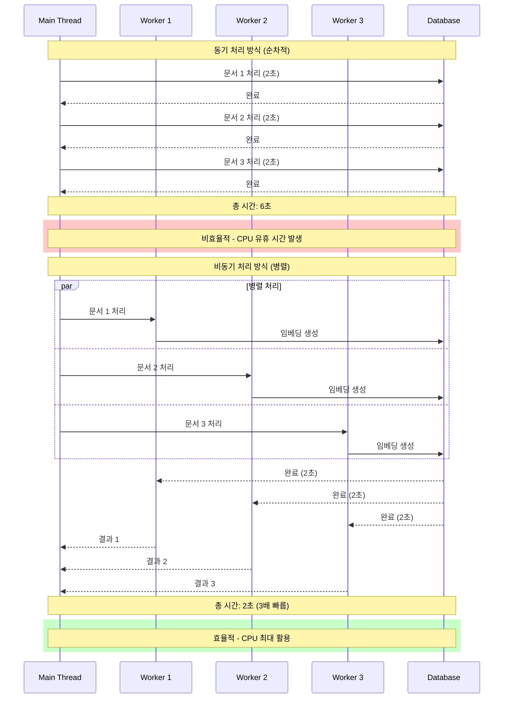
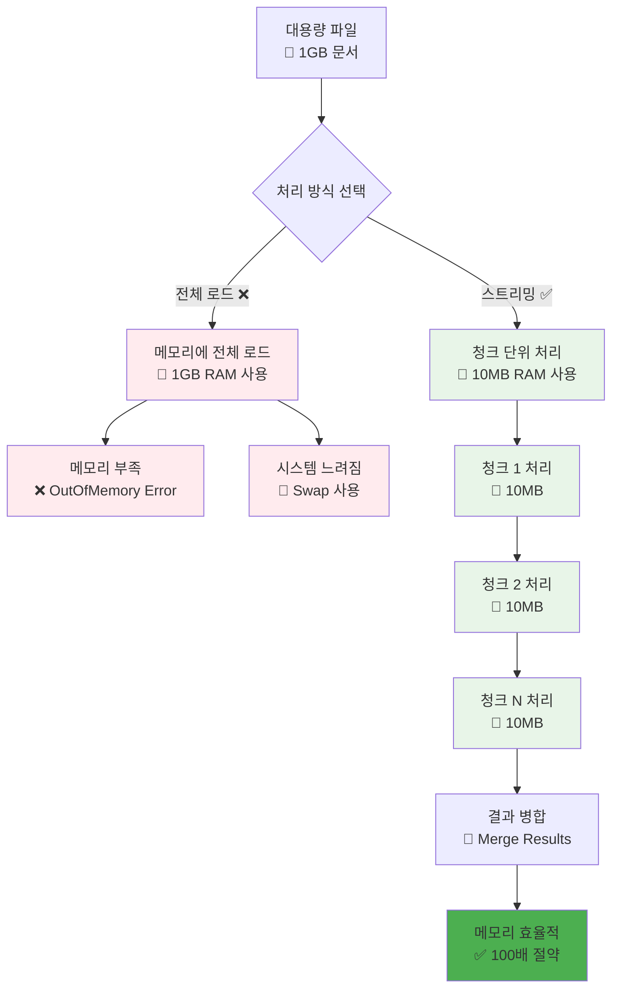
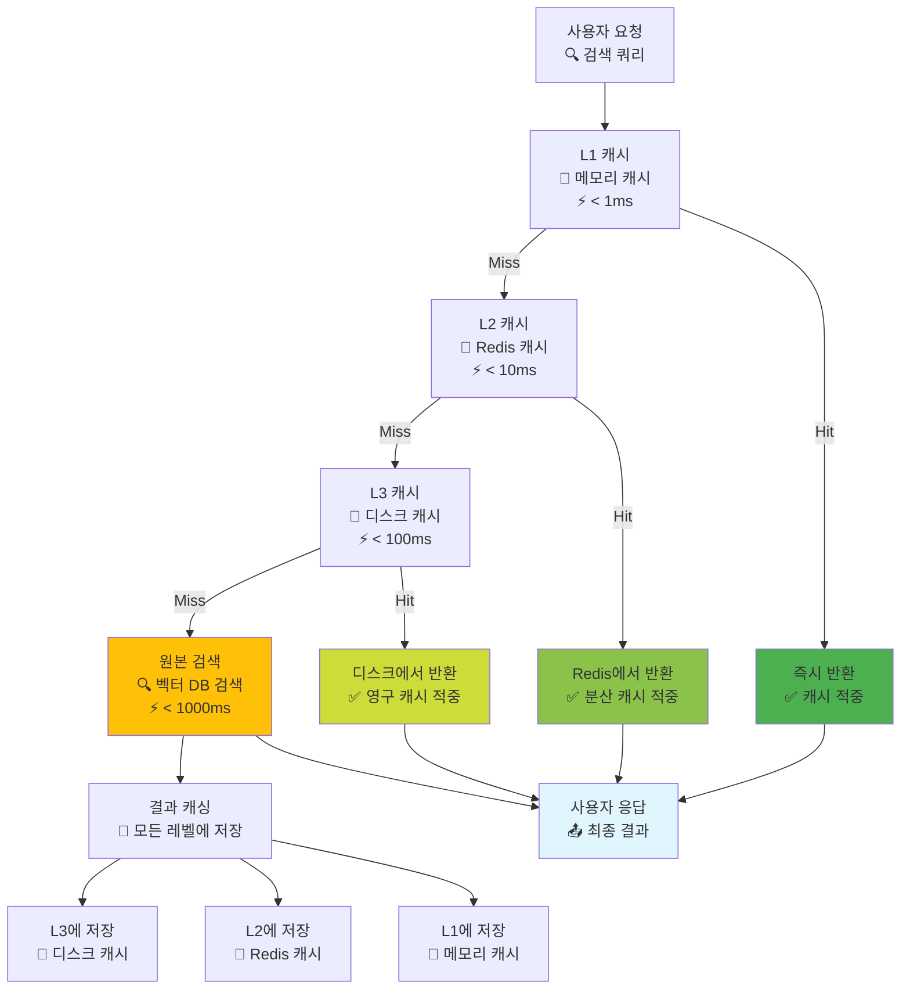
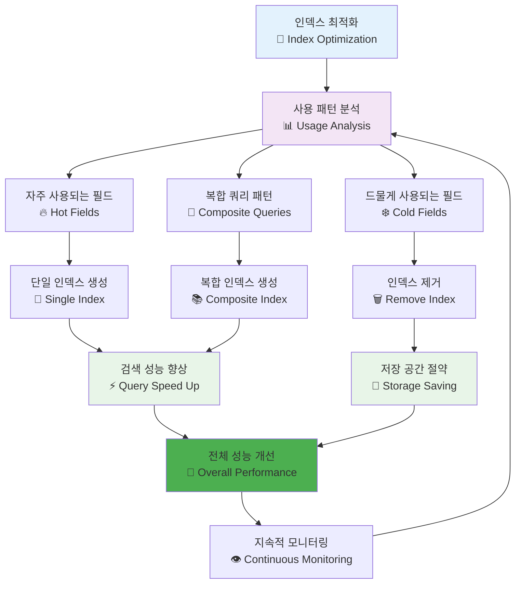
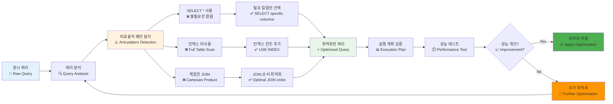
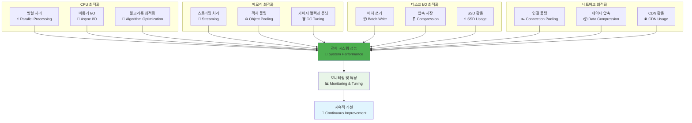
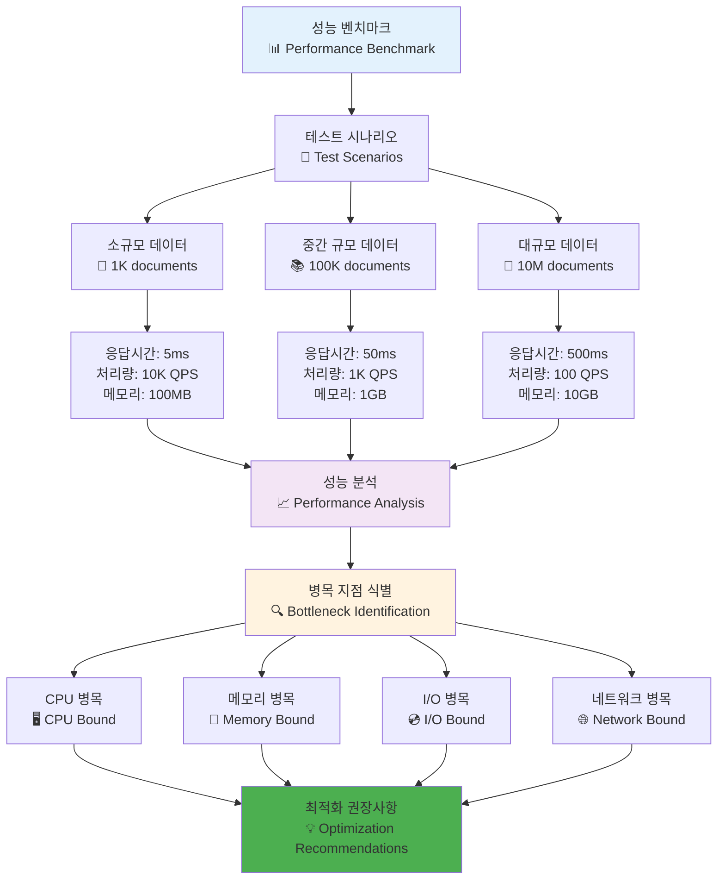

# 성능 최적화 팁 다이어그램

## 1. 배치 처리 vs 개별 처리 비교

```mermaid
graph TB
    subgraph "개별 처리 방식 ❌"
        A1[문서 1] --> B1[처리 1<br/>⏱️ 100ms]
        A2[문서 2] --> B2[처리 2<br/>⏱️ 100ms]
        A3[문서 3] --> B3[처리 3<br/>⏱️ 100ms]
        A4[문서 N] --> B4[처리 N<br/>⏱️ 100ms]
        
        B1 --> C1[총 시간: N × 100ms<br/>📊 10,000 docs = 16.7분]
    end
    
    subgraph "배치 처리 방식 ✅"
        D1[문서 1-100] --> E1[배치 처리 1<br/>⏱️ 2초]
        D2[문서 101-200] --> E2[배치 처리 2<br/>⏱️ 2초]
        D3[문서 201-300] --> E3[배치 처리 3<br/>⏱️ 2초]
        D4[문서 N-100] --> E4[배치 처리 N<br/>⏱️ 2초]
        
        E1 --> F1[총 시간: (N/100) × 2초<br/>📊 10,000 docs = 3.3분]
    end
    
    G[성능 개선<br/>🚀 5배 빠름] --> F1
    
    style A1 fill:#ffebee
    style A2 fill:#ffebee
    style A3 fill:#ffebee
    style A4 fill:#ffebee
    style C1 fill:#ffebee
    style D1 fill:#e8f5e8
    style D2 fill:#e8f5e8
    style D3 fill:#e8f5e8
    style D4 fill:#e8f5e8
    style F1 fill:#e8f5e8
    style G fill:#4caf50
```

## 2. 비동기 처리 아키텍처



## 3. 메모리 효율성 최적화



## 4. 캐시 계층 최적화



## 5. 인덱스 최적화 전략



## 6. 쿼리 최적화 파이프라인



## 7. 리소스 사용량 최적화



## 8. 성능 벤치마크 및 비교


