# 종합 아키텍처 다이어그램

## 1. 전체 시스템 아키텍처 개요

```mermaid
graph TB
    subgraph "Client Layer"
        C1[Web Client<br/>🌐 브라우저]
        C2[Mobile App<br/>📱 모바일]
        C3[API Client<br/>🔌 API 호출]
    end
    
    subgraph "API Gateway Layer"
        AG[API Gateway<br/>🚪 인증, 라우팅, 제한]
    end
    
    subgraph "Application Layer"
        LB[Load Balancer<br/>⚖️ 부하 분산]
        
        subgraph "Service Instances"
            S1[Service 1<br/>🖥️ EfficientVectorStore]
            S2[Service 2<br/>🖥️ EfficientVectorStore]
            S3[Service N<br/>🖥️ EfficientVectorStore]
        end
    end
    
    subgraph "Cache Layer"
        subgraph "Multi-Level Cache"
            L1[L1 Cache<br/>💾 Memory]
            L2[L2 Cache<br/>💾 Redis Cluster]
            L3[L3 Cache<br/>💾 Disk Cache]
        end
    end
    
    subgraph "Storage Layer"
        subgraph "Vector Storage"
            V1[Vector DB Primary<br/>🔢 HNSW Index]
            V2[Vector DB Replica<br/>🔢 Read Replica]
        end
        
        subgraph "Metadata Storage"
            M1[Metadata DB<br/>🏷️ PostgreSQL]
            M2[Search Index<br/>🔍 Elasticsearch]
        end
        
        subgraph "Content Storage"
            CS1[Object Storage<br/>📄 S3/MinIO]
            CS2[File System<br/>💾 Local/NFS]
        end
    end
    
    subgraph "AI/ML Layer"
        AI1[Embedding Service<br/>🧠 Text Embeddings]
        AI2[NLP Service<br/>📝 Text Processing]
        AI3[ML Pipeline<br/>🤖 Model Training]
    end
    
    subgraph "Monitoring Layer"
        MON[Monitoring<br/>📊 Metrics]
        LOG[Logging<br/>📝 Centralized Logs]
        ALERT[Alerting<br/>🚨 Notifications]
    end
    
    C1 --> AG
    C2 --> AG
    C3 --> AG
    
    AG --> LB
    
    LB --> S1
    LB --> S2
    LB --> S3
    
    S1 --> L1
    S2 --> L1
    S3 --> L1
    
    L1 --> L2
    L2 --> L3
    
    S1 --> V1
    S2 --> V1
    S3 --> V1
    
    V1 --> V2
    
    S1 --> M1
    S2 --> M1
    S3 --> M1
    
    M1 --> M2
    
    S1 --> CS1
    S2 --> CS1
    S3 --> CS1
    
    CS1 --> CS2
    
    S1 --> AI1
    S2 --> AI2
    S3 --> AI3
    
    S1 -.-> MON
    S2 -.-> LOG
    S3 -.-> ALERT
    
    style AG fill:#e3f2fd
    style LB fill:#f3e5f5
    style V1 fill:#e8f5e8
    style MON fill:#fff3e0
```

## 2. 데이터 플로우 다이어그램

```mermaid
flowchart TD
    A[원본 문서<br/>📄 Raw Document] --> B[전처리<br/>🧹 Preprocessing]
    
    B --> C[텍스트 정제<br/>✨ Text Cleaning]
    B --> D[구조 분석<br/>🏗️ Structure Analysis]
    B --> E[메타데이터 추출<br/>🏷️ Metadata Extraction]
    
    C --> F[청킹<br/>✂️ Chunking Strategy]
    D --> F
    E --> F
    
    F --> G[의미 기반 청킹<br/>🧠 Semantic Chunking]
    F --> H[중첩 청킹<br/>🔄 Overlapping Chunking]
    F --> I[계층적 청킹<br/>🏗️ Hierarchical Chunking]
    
    G --> J[임베딩 생성<br/>🔢 Embedding Generation]
    H --> J
    I --> J
    
    J --> K[벡터 저장<br/>💾 Vector Storage]
    J --> L[메타데이터 저장<br/>🏷️ Metadata Storage]
    J --> M[콘텐츠 저장<br/>📄 Content Storage]
    
    K --> N[인덱싱<br/>📇 Indexing]
    L --> N
    M --> N
    
    N --> O[검색 준비 완료<br/>✅ Ready for Search]
    
    P[사용자 쿼리<br/>🔍 User Query] --> Q[쿼리 처리<br/>🧠 Query Processing]
    
    Q --> R[벡터 검색<br/>🔢 Vector Search]
    Q --> S[메타데이터 필터<br/>🏷️ Metadata Filter]
    Q --> T[전문 검색<br/>📝 Full-text Search]
    
    R --> U[결과 병합<br/>🔗 Result Fusion]
    S --> U
    T --> U
    
    U --> V[재랭킹<br/>📊 Re-ranking]
    V --> W[결과 반환<br/>📤 Result Return]
    
    style A fill:#e3f2fd
    style F fill:#f3e5f5
    style J fill:#fff3e0
    style N fill:#e8f5e8
    style O fill:#4caf50
    style W fill:#4caf50
```

## 3. 확장성 및 고가용성 아키텍처

```mermaid
graph TB
    subgraph "Multi-Region Deployment"
        subgraph "Region 1 (Primary)"
            R1LB[Load Balancer]
            R1S1[Service 1]
            R1S2[Service 2]
            R1VDB[Vector DB Primary]
            R1MDB[Metadata DB Primary]
        end
        
        subgraph "Region 2 (Secondary)"
            R2LB[Load Balancer]
            R2S1[Service 1]
            R2S2[Service 2]
            R2VDB[Vector DB Replica]
            R2MDB[Metadata DB Replica]
        end
    end
    
    subgraph "Global Services"
        CDN[CDN<br/>🌐 Global Distribution]
        DNS[DNS<br/>🌍 Global Load Balancing]
        MONITOR[Global Monitoring<br/>📊 Cross-Region]
    end
    
    subgraph "Data Replication"
        SYNC[Data Sync Service<br/>🔄 Real-time Replication]
        BACKUP[Backup Service<br/>💾 Point-in-time Recovery]
    end
    
    DNS --> R1LB
    DNS --> R2LB
    
    R1LB --> R1S1
    R1LB --> R1S2
    R2LB --> R2S1
    R2LB --> R2S2
    
    R1S1 --> R1VDB
    R1S2 --> R1VDB
    R2S1 --> R2VDB
    R2S2 --> R2VDB
    
    R1S1 --> R1MDB
    R1S2 --> R1MDB
    R2S1 --> R2MDB
    R2S2 --> R2MDB
    
    R1VDB --> SYNC
    R1MDB --> SYNC
    SYNC --> R2VDB
    SYNC --> R2MDB
    
    R1VDB --> BACKUP
    R1MDB --> BACKUP
    
    CDN --> R1LB
    CDN --> R2LB
    
    MONITOR --> R1S1
    MONITOR --> R2S1
    
    style DNS fill:#e3f2fd
    style SYNC fill:#f3e5f5
    style MONITOR fill:#fff3e0
    style BACKUP fill:#e8f5e8
```

## 4. 보안 아키텍처

```mermaid
graph TB
    subgraph "Security Layers"
        subgraph "Network Security"
            WAF[Web Application Firewall<br/>🛡️ DDoS Protection]
            VPN[VPN Gateway<br/>🔐 Secure Access]
            FW[Firewall<br/>🚫 Traffic Filtering]
        end
        
        subgraph "Application Security"
            AUTH[Authentication Service<br/>🔑 OAuth2/JWT]
            AUTHZ[Authorization Service<br/>👮 RBAC/ABAC]
            RATE[Rate Limiting<br/>⏱️ API Throttling]
        end
        
        subgraph "Data Security"
            ENC[Encryption Service<br/>🔒 AES-256]
            KEY[Key Management<br/>🗝️ HSM/KMS]
            AUDIT[Audit Logging<br/>📋 Compliance]
        end
    end
    
    subgraph "Application Layer"
        API[API Gateway<br/>🚪 Secure Entry Point]
        APP[Application Services<br/>🖥️ Business Logic]
    end
    
    subgraph "Data Layer"
        VDB[Vector Database<br/>🔢 Encrypted at Rest]
        MDB[Metadata Database<br/>🏷️ Encrypted at Rest]
        STORAGE[Object Storage<br/>📄 Encrypted at Rest]
    end
    
    WAF --> API
    VPN --> API
    FW --> API
    
    API --> AUTH
    AUTH --> AUTHZ
    AUTHZ --> RATE
    
    RATE --> APP
    
    APP --> ENC
    ENC --> KEY
    
    APP --> VDB
    APP --> MDB
    APP --> STORAGE
    
    VDB --> AUDIT
    MDB --> AUDIT
    STORAGE --> AUDIT
    
    style WAF fill:#ffebee
    style AUTH fill:#e8f5e8
    style ENC fill:#e3f2fd
    style AUDIT fill:#fff3e0
```

## 5. 운영 및 모니터링 아키텍처

```mermaid
graph TB
    subgraph "Observability Stack"
        subgraph "Metrics"
            PROM[Prometheus<br/>📊 Metrics Collection]
            GRAF[Grafana<br/>📈 Visualization]
        end
        
        subgraph "Logging"
            ELK1[Elasticsearch<br/>🔍 Log Storage]
            ELK2[Logstash<br/>🔄 Log Processing]
            ELK3[Kibana<br/>📊 Log Visualization]
        end
        
        subgraph "Tracing"
            JAEGER[Jaeger<br/>🔗 Distributed Tracing]
            ZIPKIN[Zipkin<br/>📍 Trace Collection]
        end
        
        subgraph "Alerting"
            ALERT[AlertManager<br/>🚨 Alert Routing]
            SLACK[Slack<br/>💬 Notifications]
            EMAIL[Email<br/>📧 Notifications]
        end
    end
    
    subgraph "Application Services"
        APP1[Service 1<br/>🖥️ Vector Store]
        APP2[Service 2<br/>🖥️ Search Engine]
        APP3[Service 3<br/>🖥️ ML Pipeline]
    end
    
    subgraph "Infrastructure"
        K8S[Kubernetes<br/>☸️ Container Orchestration]
        DOCKER[Docker<br/>🐳 Containerization]
        HELM[Helm<br/>📦 Package Management]
    end
    
    APP1 --> PROM
    APP2 --> PROM
    APP3 --> PROM
    
    PROM --> GRAF
    PROM --> ALERT
    
    APP1 --> ELK2
    APP2 --> ELK2
    APP3 --> ELK2
    
    ELK2 --> ELK1
    ELK1 --> ELK3
    
    APP1 --> JAEGER
    APP2 --> JAEGER
    APP3 --> JAEGER
    
    JAEGER --> ZIPKIN
    
    ALERT --> SLACK
    ALERT --> EMAIL
    
    K8S --> APP1
    K8S --> APP2
    K8S --> APP3
    
    DOCKER --> K8S
    HELM --> K8S
    
    style PROM fill:#e8f5e8
    style ELK1 fill:#fff3e0
    style JAEGER fill:#e3f2fd
    style ALERT fill:#ffebee
    style K8S fill:#f3e5f5
```

## 6. 성능 최적화 전략 맵

```mermaid
mindmap
  root((벡터 DB 성능 최적화))
    (저장 최적화)
      계층화 저장
        Tier 1: 벡터 임베딩
        Tier 2: 메타데이터
        Tier 3: 상세 콘텐츠
        Tier 4: 바이너리 데이터
      압축 기술
        텍스트 압축
        벡터 양자화
        델타 압축
      중복 제거
        해시 기반 중복 탐지
        유사도 기반 병합
        버전 관리
    
    (검색 최적화)
      인덱싱 전략
        HNSW 인덱스
        복합 인덱스
        파티셔닝
      캐싱 시스템
        다층 캐시
        지능형 캐시
        분산 캐시
      쿼리 최적화
        쿼리 재작성
        실행 계획 최적화
        병렬 처리
    
    (확장성)
      수평 확장
        샤딩
        복제
        로드 밸런싱
      수직 확장
        하드웨어 업그레이드
        메모리 최적화
        CPU 최적화
      클라우드 네이티브
        컨테이너화
        마이크로서비스
        서버리스
    
    (모니터링)
      성능 지표
        응답 시간
        처리량
        리소스 사용률
      알림 시스템
        임계값 모니터링
        이상 탐지
        자동 복구
      최적화 자동화
        자동 튜닝
        적응형 캐싱
        동적 스케일링
```

