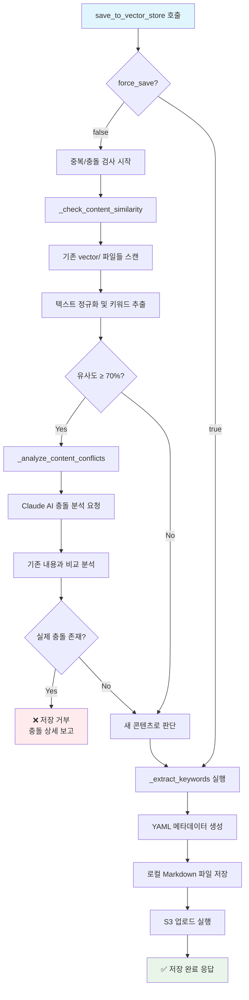

# 벡터 저장소 완전 기능 다이어그램

## 전체 시스템 아키텍처

## save_to_vector_store 상세 워크플로우

## update_vector_content 워크플로우

## query_vector_store 워크플로우

## sync_knowledge_base 워크플로우

## 내부 함수들 상세 다이어그램

### _check_content_similarity 함수

### _analyze_content_conflicts 함수

### _extract_keywords 함수

## 파일 시스템 구조

## 메타데이터 구조

## 에러 처리 및 복구 메커니즘

## 성능 최적화 포인트

